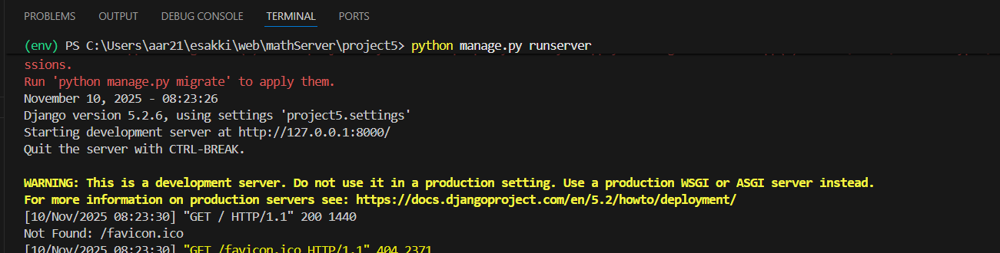

# Ex.05 Design a Website for Server Side Processing
## Date:6/11/2025

## AIM:
 To design a website to calculate the power of a lamp filament in an incandescent bulb in the server side. 


## FORMULA:
P = I<sup>2</sup>R
<br> P --> Power (in watts)
<br> I --> Intensity
<br> R --> Resistance

## DESIGN STEPS:

### Step 1:
Clone the repository from GitHub.

### Step 2:
Create Django Admin project.

### Step 3:
Create a New App under the Django Admin project.

### Step 4:
Create python programs for views and urls to perform server side processing.

### Step 5:
Create a HTML file to implement form based input and output.

### Step 6:
Publish the website in the given URL.

## PROGRAM :
```
<html>

<head>
    <meta charset='utf-8'>
    <meta http-equiv='X-UA-Compatible' content='IE=edge'>
    <title>POWER OF LAMP IN INCANDESCENT BULD</title>
    <meta name='viewport' content='width=device-width, initial-scale=1'>
    <style type="text/css">
        .box {
        
            display: block;
            width: 500px;
            min-height: 300px;
            font-size: 20px;
            background: rgb(21, 215, 63);
            background: linear-gradient(90deg, rgb(0, 85, 255) 9%, rgb(193, 166, 202) 56%);
            border-radius: 10px;
            box-shadow: rgba(5, 239, 223, 0.35) 0px 5px 15px;
        }
       </style>
</head>

<body>
   <Center> 
    <div>
        <div class="box">
            <h1>POWER OF LAMP IN INCANDESCENT BULB</h1>
            <form method="POST">
                
                <div>
                    INTENSITY : <input type="text" name="Intensity" value="{{I}}"></input>(in A)<br />
                </div>
                <div >
                    RESISITANCE : <input type="text" name="Resistence" value="{{R}}"></input>(in Ω)<br />
                </div>
                <div >
                    <input type="submit" value="Calculate"></input><br />
                </div>
                <div>
                    POWER : <input type="text" name="Power" value="{{Power}}"></input>W<br />
                </div>
            </form>
        </div>
    </div>
   </Center> 
</body>

</html>

```

## SERVER SIDE PROCESSING:


## HOMEPAGE:


## RESULT:
The program for performing server side processing is completed successfully.
